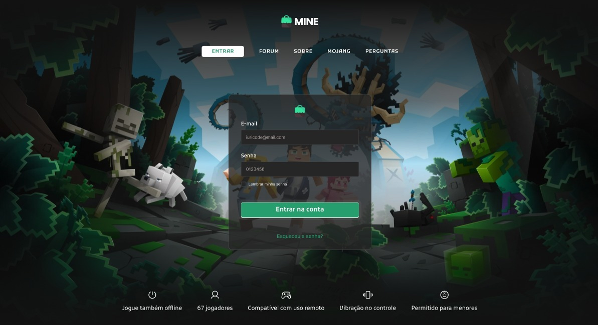

# LogMine

> Status : Em desenvolvimento ⏳ 

## Desafio [24] Codelândia - Iuri Silva
>Veja o design: https://www.figma.com/design/Yb9IBH56g7T1hdIyZ3BMNO/Desafios---CodeLab

_Tecnologias:_

- ReactJS ⚛️
- Styled-components 💅
- Vite

### Como usar:

- git clone [GITHUB](https://github.com/I-Samuel-I/LogMine) / download the zip
- npm install / yarn install
- code . (caso use o VSCode)
- npm start / yarn start

## 💻 Página oline: [link](https://logmine.bohr.io)

## 🌐 Contate-me:

